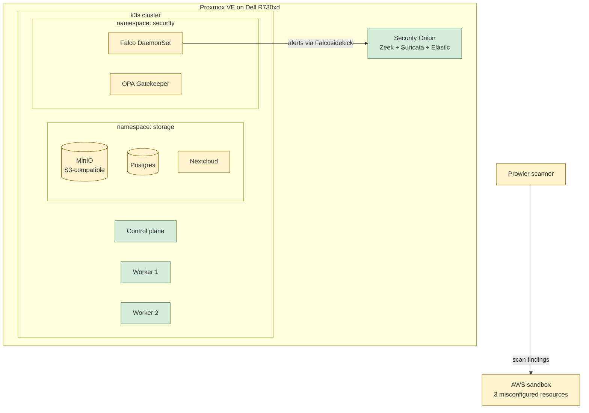

# Cloud Security Homelab — Self-Hosted Cloud with Defense in Depth

A hands-on lab series that builds a production-shaped cloud storage stack on a Proxmox homelab and progressively layers in cloud-security tooling. The end state is a small but realistic SaaS — S3-compatible object store, file-sync UI, Postgres metadata, runtime detection, admission control, network policy, posture management, and CSPM scanning against a real cloud — that mirrors what a security engineer would actually secure in a real cloud environment.

This repo is structured as a self-paced lab. Each phase is independently runnable once the previous phase is complete. Every doc explains the concepts before the commands so you build understanding, not muscle memory.

## Build status

| Phase | Status | What it produces |
|---|---|---|
| 00 — Proxmox setup | ✅ Complete | Ubuntu cloud-init template + 3 VMs |
| 01 — k3s cluster | ✅ Complete | Working 3-node k3s cluster with kubectl access |
| 02 — Storage workload |✅ Complete | MinIO + Postgres + Nextcloud, Nextcloud backed by MinIO |
| 04 — Supply chain | ✅ Complete | Trivy scans + OPA Gatekeeper admission policies |
| 05 — Runtime security | ✅ Complete | Falco runtime detection shipped to Security Onion |
| 06 — Network policy | 📋 Planned (lite) | Default-deny NetworkPolicy with the existing CNI |
| 07 — Posture / hardening | 📋 Planned | kube-bench + Kubescape baselines |
| 08 — CSPM scan | 📋 Planned (lite) | Prowler against a small misconfigured AWS environment |
| 09 — ATT&CK coverage | 📋 Planned | Detection-to-TTP mapping for what we built |
| 10 — IR runbook | 📋 Planned | Incident response playbook for one scenario |

Phases 03 (Keycloak/Vault), the full Cilium swap of phase 06, and the full Terraform stack of phase 08 are deferred — see the rationale in each phase doc.

## Architecture



## Prerequisites

- Proxmox VE 8.x with at least 8 vCPU and 16 GB RAM available for the k3s cluster (3 VMs, 4 vCPU / 8 GB / 60 GB each — see phase 00 in `archive/` if you need to redo this)
- A workstation with `kubectl`, `helm`, `git`, `curl`, and a text editor
- Working kubeconfig pointing at your k3s cluster — `kubectl get nodes` should return the three nodes
- A DNS strategy: either a real domain pointed at your cluster, `/etc/hosts` entries on your workstation, or a wildcard via something like `nip.io` (the docs use `lab.internal` as a placeholder)
- A Security Onion deployment for phase 05's log shipping. If you don't have one, phase 05 still works — you just write Falco events to local files instead.
- An AWS account for phase 08. Free tier is fine; the lab spend is well under $1.

## How to use this repo

1. **Read the phase doc all the way through before running any commands.** Every doc opens with concept sections — what the components are, why they exist, how they relate. The commands assume you've absorbed those.
2. **Run validation steps after every phase.** Each doc ends with a "Validation" checklist. Don't move on until everything in it is true. Phase-to-phase debugging is much harder than in-phase debugging.
3. **Take Proxmox snapshots before destructive changes.** The phase docs flag every destructive step.
4. **Don't commit secrets.** The `.gitignore` excludes the obvious things (kubeconfigs, tfstate, scanner reports, cosign keys), but every phase doc that produces a secret reminds you again.

## Conventions

- Commands prefixed with `$` run on your workstation. Commands without a prefix run on cluster nodes via SSH.
- All workloads land in workload-specific namespaces (`storage`, `security`, etc.) — never `default`. This makes network policies and admission controls cleaner.
- Hostnames in examples use `lab.internal`. Replace with your own domain or `/etc/hosts` mapping.
- Manifests intended to be applied directly live in `manifests/`. Helm `values.yaml` files also live there.

## Repo layout

```
cloud-security-homelab/
├── README.md                          # This file
├── .gitignore                         # Excludes secrets, kubeconfigs, scanner output
├── docs/
│   ├── 02-storage-workload.md         # Day 1 — MinIO + Postgres + Nextcloud
│   ├── 04-supply-chain.md             # Day 2 — Trivy + OPA Gatekeeper
│   ├── 05-runtime-security.md         # Day 3 — Falco + Security Onion forwarding
│   ├── 06-network-policy.md           # Day 3 stretch — default-deny NetworkPolicy
│   ├── 07-posture-hardening.md        # Day 4 AM — kube-bench + Kubescape
│   ├── 08-cspm-lite.md                # Day 4 PM — Prowler against AWS
│   ├── 09-attack-coverage.md          # Day 5 AM — ATT&CK mapping
│   └── 10-ir-runbook.md               # Day 5 AM — IR playbook
└── manifests/
    ├── 02-storage/                    # Helm values + raw manifests
    ├── 04-supply-chain/                # Gatekeeper templates + constraints
    ├── 05-runtime/                    # Falco values + custom rules + sidekick config
    └── 06-network/                    # NetworkPolicies
```

## Why this exists

This repo is a learning sandbox for cloud-native security at the intersection of Kubernetes, object storage, and detection-and-response. The goal is fluency through hands-on work — being able to articulate *why* each layer exists, what it would catch, what it wouldn't, and what would be different in a real production environment. Every doc is written with that in mind.
